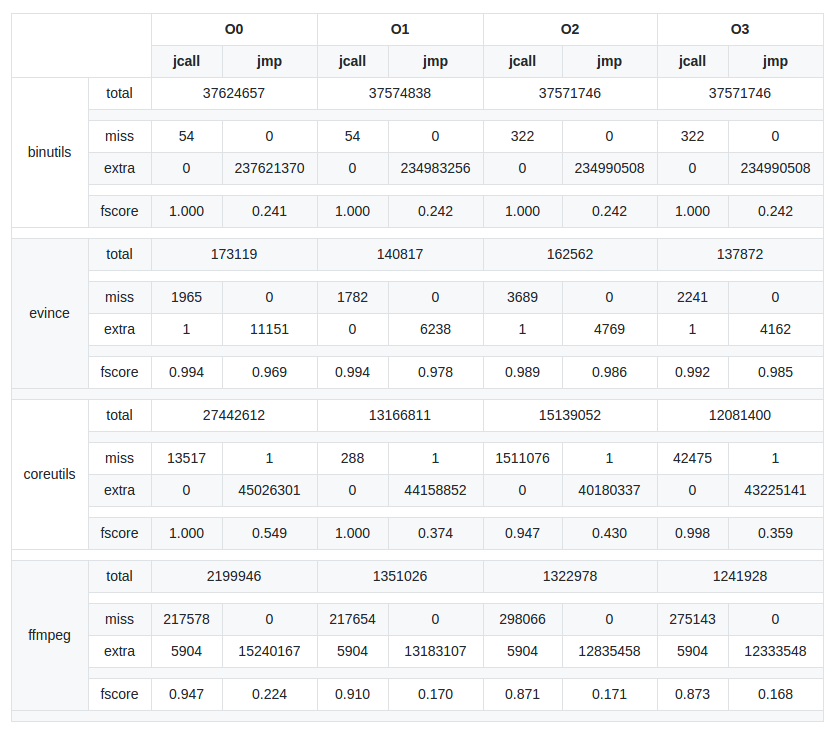
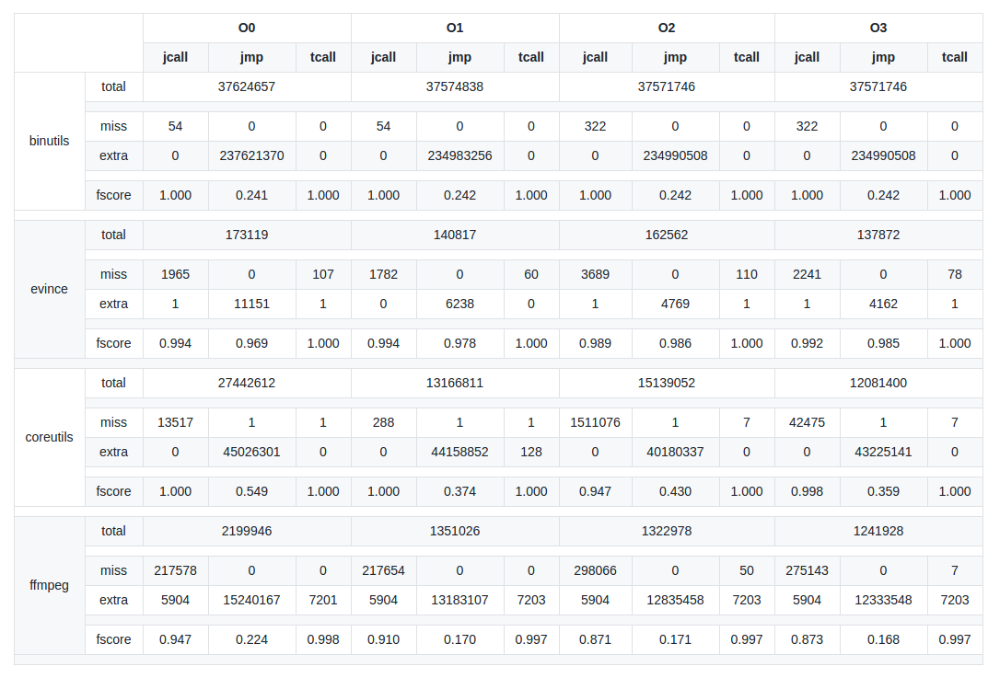
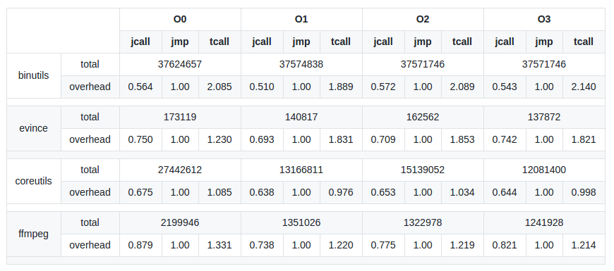
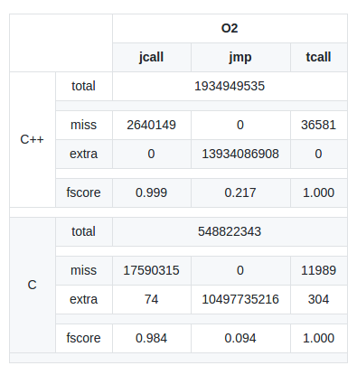

# `iCi` - intuitive Call instrumentation

## In a few words

Let us consider 
* *B* a binary 
* *F(B)* the set of functions implemented in *B*
* *e* an execution of this binary

The problem `iCi` addresses is: 

>  How to instrument every call to every function *f* of *F(B)* during an execution *e* of *B*?

`iCi` proposes an eponym heuristic-based approach to do this. This repository also includes three other approach to compare with `iCi`:

* `oracle`: a very unefficient symbol-based instrumentation that gives the ground-truth
* `jcall`: instrumentation of every `CALL` instruction, plus every `JMP` instruction that comes from the `.plt` section
* `jmp`: instrumentation of every `CALL` instruction, plus every `JMP` instruction (each one is considered as a call)

Our experiments show that a naive implementation of call instrumentations (`jcall`or `jmp`) is not efficient (either missing calls or producing 
a huge amount of false positives), especially with compiler optimizations.
On the other hand, our implementation `iCi` gives very accurate results, as it catches 99.99% of calls with no significant false positives (see [relative section](#results)), 
but it comes with an overhead.

Here is the overview of the following sections:

* [Problem](#problem): emphasis of the problem to solve, by showing that naive approaches are not efficient
* [Approach](#approach): presentation of our heuristic-based solution
* [Results](#results): experimentals results, to show that our approach is efficient
* [Conclusion](#conclusion): last words and conclusion on this work
* [User Guide](#user-guide): how to use the tool

## Problem

As mentioned in the previous section, the problem we address here is to catch, dynamically and in real-time, every call to any function embedded in a given binary. 
An obvious approach is to instrument every `CALL` instruction. However, there are calls that are not based on the `CALL` instruction. In particular, every call to a 
dynamically-loaded library goes through the `.plt`, which uses the `JMP` instruction  to achieve this.  

To emphasis the problem we address, we propose two simple approaches and show that they either produce false negatives, or a huge number of false positives. 
But first, let us give some details about the oracle we use.

---



**Table 1** - *FScore of naive approaches to the problem of call detection*

---

### `oracle`

We construct the `oracle` by first fetching the symbol table in the binary file to get the function entry points. 
At load time, it also instruments routines (`RTN`) with `Pin` to get entry points of functions from libraries. 
Then, during the execution, `care` detects any discontinuity in the execution (meaning that there is a non-sequential evolution of `%rip`). 
In this case, it compares the new value of `%eip` with every function entry point that he knows. 
If there is a match, then it increments the number of calls to this particular function. 

From this oracle, we get the total number of calls, regarding one execution, that we should detect for every function. 
Every other analysis we propose compares to this one by confronting the number of calls detected for each function. 
A call detected by the oracle and missed by a given analysis is called a *false negative*, and a call detected by 
the analysis that is not present in the oracle is called a *false positive*. 

**Important note**: with this method, we only get an oracle for functions that are either embedded in the binary or imported from libraries using symbols. 
However, we do not have any information about what happens inside libraries (because we do not know the entry point of functions). For this reason, 
each time we use the oracle to produce numeric results, please note that this excludes whatever happens from library to library. 

### `jcall`

The first naive way of implementing call detection, named `jcall`, instruments every `CALL` instruction plus every `JMP` instruction located in the `.plt` section.  
The results shown in **Table 1**
show that this method gives good results for binaries compiled with `-O0` and `-O1`, but misses a significant number of calls with
`-O2` and `-O3`. For example, `jcall` has a FScore of 0.87 on `ffmpeg` compiled
with `-O2` or `-O3`, because it misses almost 300,000 calls. 

What happens here? At `-O0` and `-O1`, there is no tail-call optimization. Therefor, the vast majority of calls are actually implemented by a 
`CALL` instruction in the binary, or a `JMP` from the `.plt` when it targets a function in a shared libary. 
However, at `-O2` and `-O3`, `gcc` implements a tail-call optimization which leads to transforming the calls that are the last instruction
of a given function by a `JMP`-based call which is more efficient. At `-O3`, this optimization is still present, but because `gcc` also
starts inlining functions, there are less calls to detect and thus less false negatives in absolute. 

**Note that** this implementation, anyway, gives no *false positive*, at it focuses on the `CALL` instruction. 

### `jmp`

The previous implementation produces no **false positive**, but misses calls (and in particular tail-calls). The second approach we propose
is to implement a much more conservative way: consider every `JMP` as a call. From such an approach, it is clear that a lot of false positives
will be produced (see **Table 1**
). However, we aim to show that there is no more *false negative*, and that would imply that the main problem here, if one wants to catch every 
call, is to differentiate `JMP`-based calls from regular jumps inside a function. 

**Table 1** shows that this is exactly what happens. The `jmp` instrumentation produces no *false negative*, which means that, in our benchmark, 
there is no call to a function that is implemented at assembly level by an instruction which is neither a `CALL` or a `JMP` (conditional or unconditional).
The other result from this experiment is that the number of *false positives* can be very significant. 

### So, problem?

In this section, we showed that two naive approaches to catch calls are not efficient. 

* `jcall` produces no *false positive*, but misses some calls, especially with optimizations from the compiler
* `jmp` produces no *false negative*, but interprets every jump as a call, which lead to a huge amount of *false positive*. 

In the next section, we address this problem, and propose an approach that aims to detect `JMP`-based calls, such that:

* the number of *false negatives* is lower than what we have with `jcall`,
* the number of *false positives* is as close to zero as possible.


## Approach

As mentionned in the previous section, the main problem is to distinguish `JMP`-based calls from internal jumps. 
As we do not want to rely on the symbol table, we do not assume to know function boundaries at the beginning of the 
execution. In addition, we do not assume to be able to analyse statically the binary before the execution at this point. 
Therefore, the analysis is only based on the flow of instructions that are actually executed by the CPU. 

The goal is to catch every call to a function in real-time. This means that, for each jump, we want to decide
*on-the-fly* if this jump should be considered as a call or not. This requirement is dut to the fact that 
we want this approach to be applicable for real-time analysis such as CFI. 

### Overview

In a few words, our approach consists of considering every `CALL` instruction and `JMP` instructions from the `.plt` - exactly
in the same way `jcall` works, plus instrumenting every `JMP` instruction. For each `JMP` that is not from the `.plt`, 
we perform some heuristic-based checks to conclude if it is a call or not. These checks are of two categories:

* **exclusive checks**: if one of these checks fails, then the `JMP` is not considered as a call
* **inclusive checks**: if one of these checks passes, then the `JMP` is considered as a call

Note that inclusion checks are performed after exclusion checks. In addition, if neither of these two categories of checks 
lead to a conclusion, then we apply a default policy which can be configured in our implementation. In our experiments, 
we always use as a default policy to consider a `JMP` instruction as *not a call* if checks are inconclusive. 

Another point important to notice is that, during the execution, we keep a memory of the previous decisions. 
In particular, everytime a call is detected (either based on the `CALL` instruction, a jump from the `.plt`
or a `JMP` instruction that passes an inclusion check), the target of this call is added to a list of 
*known entry points*. This is important, because it means that the more the execution goes, the more entry points
we know, and the more accurate and efficient is the detection. 

### Heuristics

This section presents the heuristics and checks we perform to differentiate regular jumps from calls.

Note that we keep track of the following data, that are accessible (or made accessible by our implementation) at every jump 
instrumentation:
* the current program counter `%eip`,
* the target of the jump (address),
* the current entry point, which is the target of the last instruction
that was detected as a call (either `CALL`, `JMP` from `.plt` or any `JMP` 
instruction that matched an inclusion check) - note that this data might
be inaccurate at some point, for instance if we missed the last `JMP`-based call,
* the current state of the stack (*i.e.*, value of `%esp`),
* the state of the stack when the last call occurred, 
* information about the return point of functions seen so far (see
[relative](#returns) section).


#### Exclusion checks

* *From `.plt` to `.plt`*: this is to avoid internals jump in `.plt` that are used for 
name resolution, `.got` entry fetching, etc. 
* *Stack inconsistency*: check if the state is in the same state as it was when the last call occurred - indeed, for a tail-call to happen correctly, the stack must be cleaned first
and the top of it should contain the (same) return address that was pushed before the 
previous call.
* *Internal jump before*: if the target of the jump is between the current entry point
(*i.e.*, the target of the last detected call) and the current `%eip`, then it is 
an internal call (assuming that functions are ot interlaced in memory). 
* *Internal jump after*: if the target of the jump is between the current `%eip` and 
a known return point of the current function (see section [returns](#returns)), 
then it is an internal call.

#### Inclusion checks

Remember that inclusion checks are performed only if no exclusion check
was conclusive. Thus, at this point, we know that the stack is consistent
for a call, that we are not in the `.plt`, etc.

* *Known entry point*: if the target of the jump is a known entry point, then it is a
call. 
* *External jump before*: the target of the call is before the last known entry point.
Assuming that functions have a single entry point, it means that we are leaving the 
current function boundaries, therefore it is a call.
* *External jump after*: similarly to the previous argument, if we cross a known 
return point of the current function, then it is a call. 
* *Cross entry point*: this chececk here if there is any known entry point between the current 
`%eip` and the target of the jump. If so, then we consider this jump as a call.
It is the most costly check, therefore it is performed
last. Implementation details are given in [this section](#function-information).

### Some implementation details

We present here some details about the implementation. 

#### Function information

Each time a call is detected, we store information about the called function. 
If the target is not known yet, then we need to add an entry to a data structure, 
in order to detect later calls easily. 
This entry also stores the number of times a function is called, plus a list of instructions
that caused the function to be called (for debug and diagnostic purposes).
In addition, it contains information about known boundaries of function
(especially the exit point) - see next section. 

To efficiently access the entry corresponding to a given function by its entry point, 
we store these information in a **hash table**. This hash table is indexed by 
the twenty least-significant bits of the address after a right shift of 4 bits 
(because of memory alignment, many functions have an address with least-significant
bits to zero). From this hash table, we can check quickly if a given address corresponds
to an entry point of a known function, and if so to access the information 
relative to this function. 

In addition, for the last inclusion check (*cross entry point*), we need a way to 
determine if there is a known entry point between two addresses. To do so, the hash
map is not efficient, as we would have to check every entry of the table one by one. 
For this purpose, we maintain, in addition to the hash map, a **binary search tree**
that stores every known entry point of functions (only entry points, not the whole info
about functions). This data structure allows to efficiently check if there is a
known entry point between the target of a jump and the address of the instruction. 

#### Returns 

Two checks (*internal jump after* and *external jump after*) rely on the knowledge
of the lower boundary of the current function. 
This information is stored in the correspondant entry of the hash table for 
each function. 
We determine it by instrumenting `RET` instructions. Each time a `RET` instruction is 
executed, we add it to the list of known exit points of the last called function. 

#### Stack of calls

For several purposes, and in particular the *stack unconsistency* check, we need
to keep a notion of stack of calls. For this purpose, every time a call is detected, 
we push a new entry on the top of our **stack** structure.
This entry stores the following information:
* the target of the call (*i.e.*, the entry point of the function being called),
* the supposed return address (*i.e.*, the address of the instruction statically 
following the instruction causing the call),
* the current value of `%esp`.

Each time a `RET` instruction is instrumented, we unstack entries, until one of them
has a return address that corresponds to the target of the `RET`.
Every function that is unstacked is considered to be returning as well. 

#### Caching

To speed up the implementation and reduce overhead, we maintain a cache of the jump
instructions that were pruned before in the execution. 
To do so, we use another **hash table**. Each time an exclusion check matches, the 
pruned jump address is added to the hashtable. Therefore, for every jump instruction, 
before doing any exclusion check, we look for it in the hash table, and if so 
we prune it once again without performing any further test. 

## Results

This section presents the different results we obtained during our experiments.

**Note** that, for every *accuracy-relative* test, we perform every instrumentation
(*i.e.*, `oracle`, `jcall`, `jmp` and `iCi`) in a single execution
(to handle non-deterministic executions). For overhead measures, we perform
a single instrumentation per execution. This means that the overhead results may not
be completely accurate in the case of non-deterministic executions. 

### F-Score

---



**Table 2** - *F-score of `iCi` compared to `jcall` and `jmp`*

---

**Table 2** presents the main results of our experiments. On `coreutils`, 
`binutils`, `evince` and `ffmpeg`, it shows that the f-score of `iCi` is always
higher than what we have with the other naive techniques. It also shows
that the accuracy of this approach does not suffer from optimizations at compilation
time.

### Overhead

---



**Table 3** - *Overhead of the different approaches in time of execution*

---

This section presents the overhead of the different implementations. 
We decided to use, as a reference, the `jmp` implementation. The reason of this
choice is that experiments show that, to catch every call, one need to instrument 
`JMP` instructions as well as `CALL` instructions. Then, the overhead becomes
the cost of differentiating a regular jump from a `JMP`-based call. 

**Table 3** shows the overhead in time of `jcall` and `iCi` relatively to `jmp`. 


### `SPEC CPU2006`

---



**Table 4** - *Experimentations on `SPEC CPU2006`*

---

In addition to our benchmark, we tested our approach on `SPEC CPU2006`. 
These results are not reported in the main results, as we did not tested `SPEC`
with every optimization level - we only tested it with `-O2`, for two reasons:

* it is the default option when compiling `SPEC` with no manual change in the configuration 
files,
* it is the most challenging level of optimization, as shown in the section [Problem](#problem).

**Table 4** shows the results of our implementation, in comparison with others, 
on every `SPEC CPU2006` benchmark in `C` or `C++`.

## Conclusion

These experiments emphasis the following points:

* catching every call to functions is indeed a problem, especially when programs are compiled
with optimization,
* the method we propose is able to detect calls efficiently, with a very few false
positives and false negatives,
* for each of these misdetections, the tool we designed can show the instructions that
led to an error and the number of its occurrences,
* the overhead is significant over a `jcall` implementation, but in many cases not 
that much compared to `jmp`.

Note that, to apply this method for CFI for instance, 
the overhead could be significantly reduced
execution after execution, if we use the knowledge gained from previous 
executions to prune jumps that are not called (we would not need to even instrument them),


## User Guide

Note: if you only want the tool, checkout the `master` branch; if you want to replay the experiments shown in the paper, checkout the `benchmark` branch.

### Installation

#### Requirements

* You need to have `Pin 3.4` installed.
* You need to have `libyaml-dev` package installed (for parsing configuration files).
* It is also better to set a virtualenv for `iCi`. If you want to use the scripts we used to replay
our experiments, this virtualenv must be located at .venv/iCi.

#### Dependencies

First clone the repo:

```
git clone https://github.com/Frky/iCi.git
```

Second, install the python dependencies (preferably in your virtualenv).

```
pip install -r requirements.txt
```

#### Configuration

Copy the template configuration file (`config/template.yaml`) to `config/config.yaml`, and fill the entries `path` and `bin` with values corresponding to your installation of `Pin`. 
The rest of the configuration file should be OK, unless you use `iCi` in an unexpected way. 

### Usage

```
usage: iCi.py [-h] [--analysis ALS [ALS ...]] [--res [RES]] [--log [LOG]]
              [--pgm [PGM]] [--args [ARGS]] [--ignore-libs] [--ignore-ld]
              [--no-ins] [-v] [-q] [--run]
              ALS

iCi -- intuitive Call instrumentation

positional arguments:
  ALS                   basic command to execute (launch, diff, etc.)

optional arguments:
  -h, --help            show this help message and exit
  --analysis ALS [ALS ...]
                        analysis to launch (e.g. oracle)
  --res [RES]           file to log the (plaintext) results of the analysis
  --log [LOG]           file to log the (not formatted) results of the
                        analysis
  --pgm [PGM]           binary program to be executed
  --args [ARGS]         arguments to give to the binary for the execution
  --ignore-libs         ignore everything that happens in the libraries during
                        instrumentation
  --ignore-ld           ignore every instruction from and to ld in the output
  --no-ins              do not compare instruction by instruction (only total
                        number of calls
  -v                    output detailed results
  -q                    quiet mode -- only output the minimum result info
  --run                 Re-run instrumentations before diff

```

### Examples

#### Run `oracle`

```
$ ./iCi.py launch --analysis oracle --pgm [PGM] --args "[ARGS]" -v
```

Other options:

* `--ignore-libs` to avoid instrumenting every instruction of libraries 
* `--res [RES]` to store the results in a file instead of `stdout`

**DISCLAIMER** Remember that, because `iCi` relies on the symbol table for the `oracle` analysis, you should target non-stripped binaries.

#### Compare `oracle`, `jcall` and `iCi`

```
$ ./iCi.py diff --run --ignore-libs --analysis oracle jcall iCi --pgm [PGM] --args "[ARGS]" -v
```

Details:

* `--run` means that the program will be executed to generate new results ; if not specified, `iCi` assumes that the analyses were previously launched and that the results can be found in the default directory (`log/`)
* You can add more analyses ; then the comparison will be computed between the first one (here `oracle`) and every other one 
